# Guild to creating Jenkins and implimenting CICD Pipeline

## Building Jenkins with enviroment variables
1. Set-up an EC2 instance on VPC (Go to for VPC guide)  
    i. For NSG select ports 22, 8080, and 80  
    ii. Other NSG settings   
    iii. Launch Instance  
2. Connect to Instance with SSH.  
3. Code on Ubuntu.   
    i. sudo apt update  
    ii. sudo apt install default-jdk  
    iii. java -version  
    iv. wget -q -O - https://pkg.jenkins.io/debian-stable/jenkins.io.key | sudo apt-key add -  
    v. sudo sh -c 'echo deb https://pkg.jenkins.io/debian-stable binary/ > /etc/apt/sources.list.d/jenkins.list'  
    vi. sudo apt update  
    vii. sudo apt install jenkins  
    viii. sudo systemctl start jenkins  
    ix. sudo systemctl enable jenkins  
    x. sudo cat /var/lib/jenkins/secrets/initialAdminPassword
4. Use PublicIP and port 8080
5. Using your Initial Admin Password paste it in
6. Set-up Plug-ins including Access to GitHub, SSH Agent, Git Publisher.

# The CI-CD process on Jenkins
This is a guide on how to create a CI-CD process for an app to run on an EC2 instance through Jenkins Pipeline

### Architecture Diagram


### Step 1. Connecting your local Git repository to GitHub.
1. Create a Git repository within the folder with all the app content
```
git init
```
2. Create a remote repository on GitHub
3. Connect your local repository to the GitHub repository
```
git remote add origin git@github.com:LukeWeller7/App_Folder.git
git branch -M main
```
4. Create a secondary branch, this is where any user changes will occur
```
git checkout -b dev
```
5. Once you have made any changes, you can push to GitHub. This concludes Step 1.
```
git add .
git commit -m "Commit Message"
git push -u origin dev
```

## Step 2. Setting up a Jenkins CI
This step is to set up a CI Job on Jenkins that will test the app whenever a new push is sent to GitHub. This ensures whether the changes to the app will work or not. If not an email response with error will be sent.
### Setting up the Webhook in GitHub
1. Go to your GitHub repository where you have saved your app folder.
2. Go to Settings for that repo
3. In the navigation tab, go to Webhooks
4. In Webhooks, select Add Webhook  
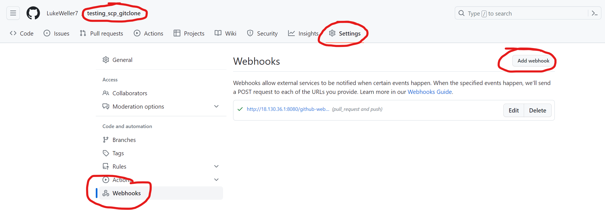
   1. Enter the payload URL: http://<Jenkins IP:8080>/github-webhook/ 
   2. Content Type - application/JSON 
   3. Select individual events from list - Pushes, Pull requests 
   4. Add Webhook  
   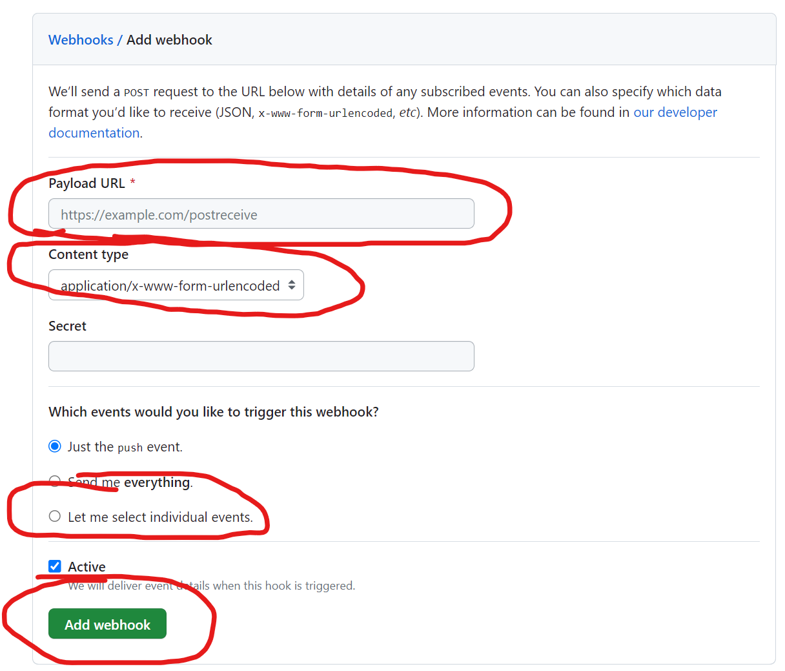

### Creating Jenkins Job
1. Go to Jenkins and on the main page select New Item  
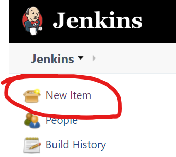
2. On the create new job page, complete the following:
   1. Enter the name of Job
   2. Select Freestyle 
   3. Select Ok  
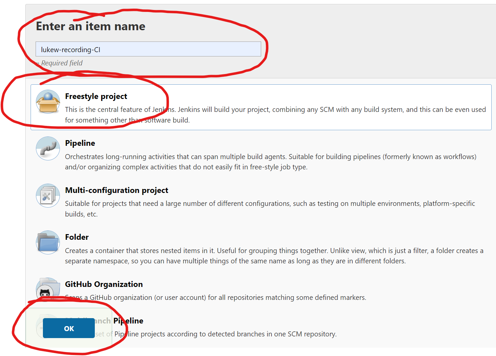
3. General Tab
   1. Fill out the description 
   2. Select "Discard old builds"
   3. For "Max # of builds to keep", enter 3
   4. Select "GitHub project"
   5. For "Project URL", enter the HTTPS URL from your GitHub repo
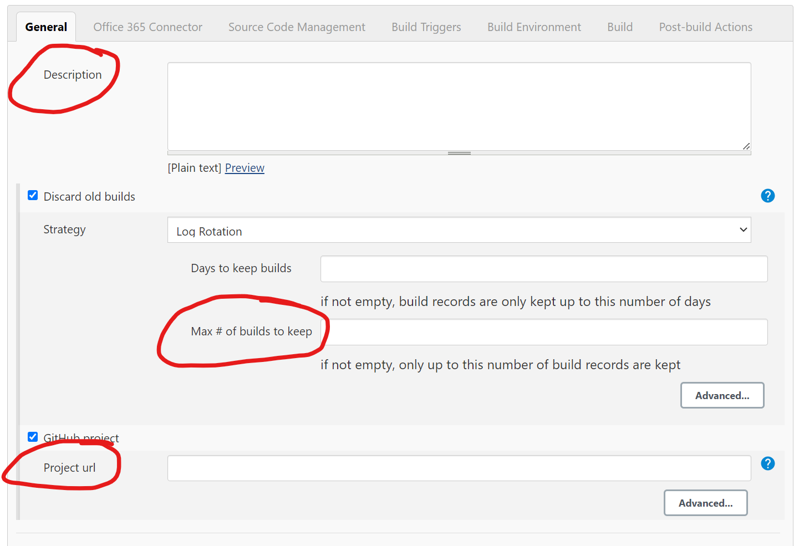
4. Office 365 Connector
   1. Select "Restrict where this project can be run"
   2. For "Label Expression", enter the agent node you want to use
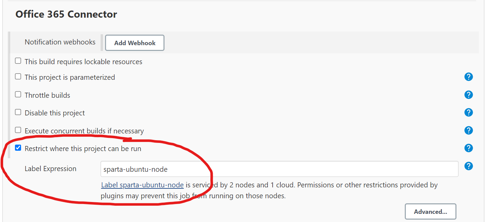
5. Source Code Management
   1. Select "Git"
   2. In "Repositories", for "Repository URL", enter the SSH URL from your GitHub repo
   3. For "Credentials", select "Add" to add your private key, if you have already done this, please select your ey name from the dropdown menu and skip step **iv**
   4. In the "Add" dropdown, select "Jenkins"
       1. For Kind, select "SSH username and private key"
       2. Username - use a naming convention
       3. Private Key - Enter Directly - Add - Enter your private SSH key linked to your GiHub repo
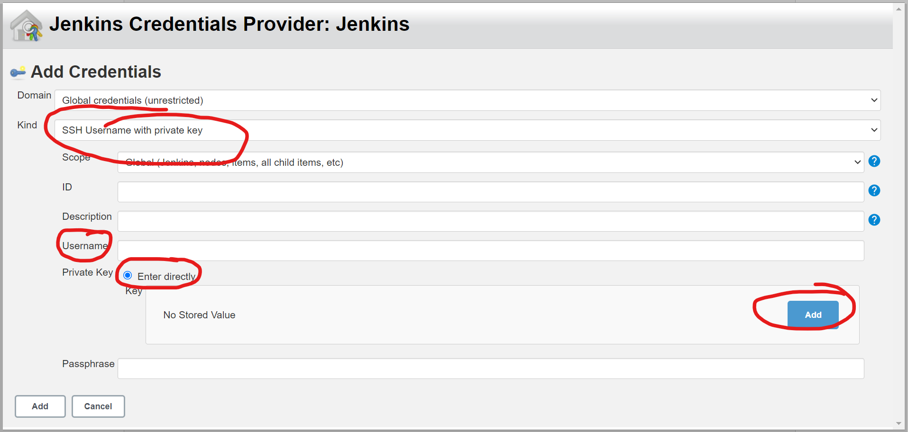
   5. For "Branch Specifier", enter */main  
   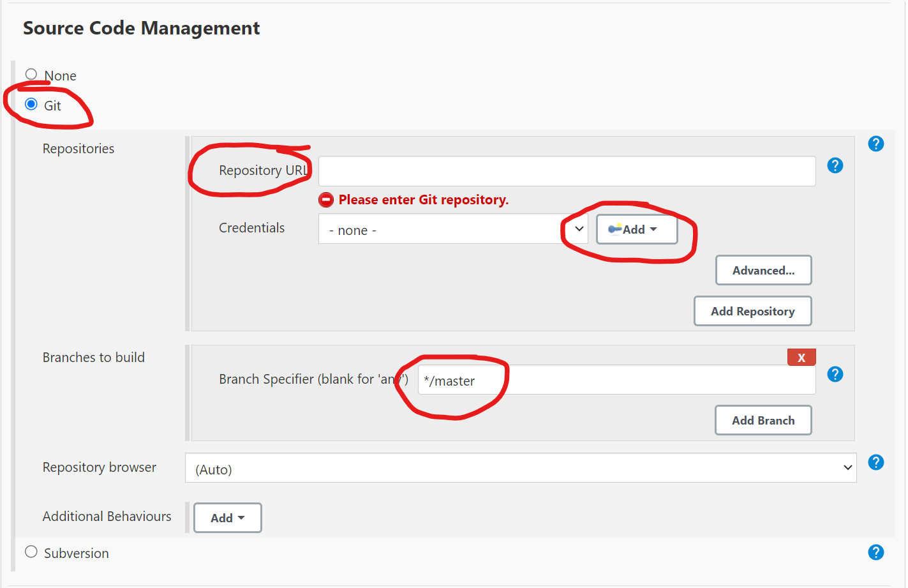
6. Build Triggers
   1. Select "GitHub hook trigger for GITScm polling"
7. Build Environment
   1. Select "Provide Node & npm bin/ folder to PATH"  
   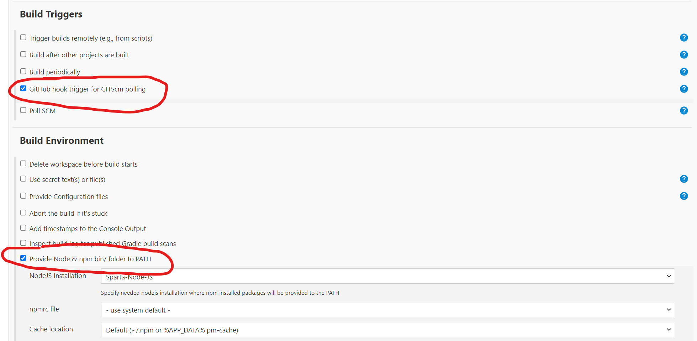
8. Build
   1. Select "Add build step"
   2. From dropdown select "Execute Shell"
   3. In "Command", enter the commands to run
9. Apply
10. Save  


## Step 3. Setting up Jenkins Job to Merge repos
Now that we have a CI that will test the code to ensure it is working, we can now set up a post build that will merge the commits from the Dev branch into the Main branch, so it is ready to run.
### Creating CI Pipeline on Jenkins.
Here you can either re-create your CI Jenkins job or make the changes into you current Jenkins Job (If something isn't mentioned here unlike the other Job, that means it's not being used.)
1. Create a new Jenkins job
2. General
   1. Discard old builds
   2. Max # = 3
   3. GitHub project
   4. Project URL = HTTPS URL
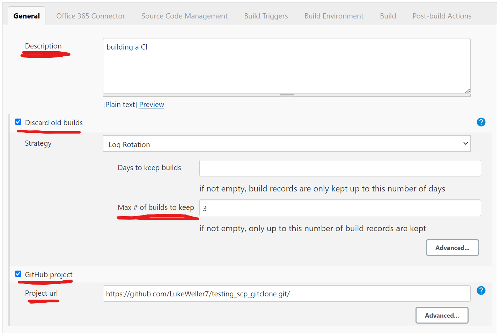
3. Office 365 Connector
   1. Label Expression = Agent node
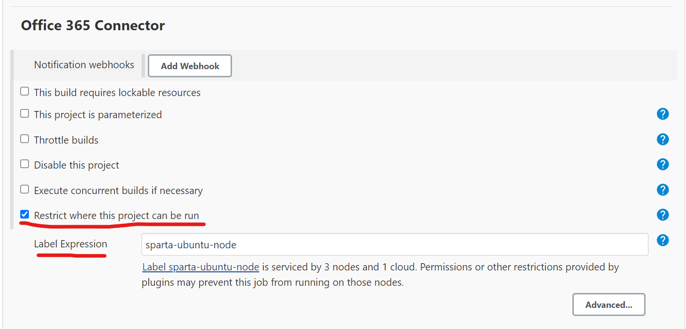
4. Source Code Management
   1. Git
   2. Repository URL = SSH URL
   3. Credentials = Private SSH Key
   4. Branch Specifier = dev
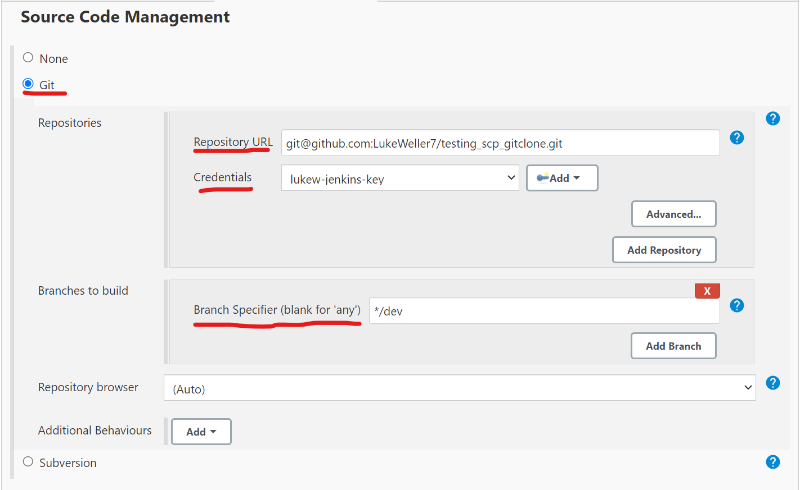
5. Build Triggers
   1. GitHub hook trigger
6. Build Environment
   1. Provide Node & npm
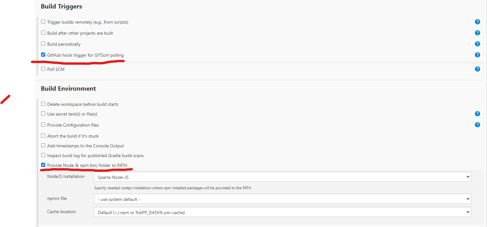
7. Build
   1. Add build step
   2. Execute Shell
   3. Command = test commands
8. Post-build Actions
   1. Add post-build action
   2. Build other projects
   3. Projects to build = merge job
   4. Trigger only if build is stable
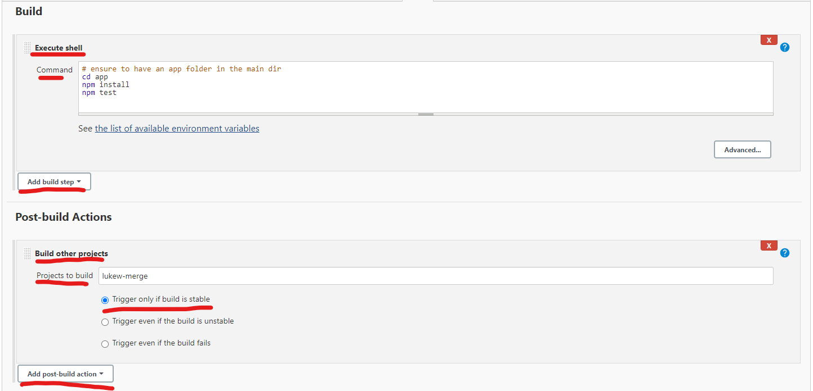
9. Apply
10. Save


### Creating Merge Job on Jenkins
This Job will allow Jenkins to take the committed changes from the Dev repo and push it into the main repo on GitHub
1. Create a new Jenkins Job (Name the same as Post-build job name)
2. General
   1. Discard old builds
   2. Max # = 3
   3. GitHub project
   4. Project URL = HTTPS URL

3. Office 365 Connector
   1. Label Expression = Agent node
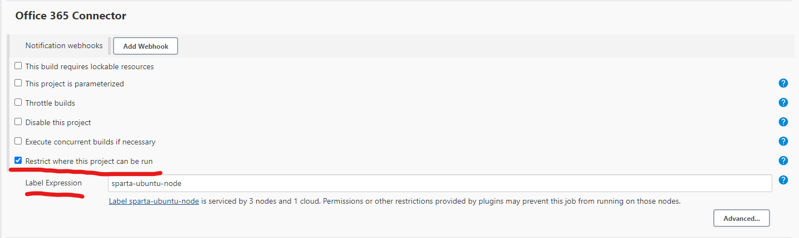
4. Source Code Management
   1. Git
   2. Repository URL = SSH URL
   3. Credentials = Private SSH Key
   4. Branch Specifier = dev
   5. Add
   6. Merge before build
   7. Name of repository = origin
   8. Branch to merge to = main
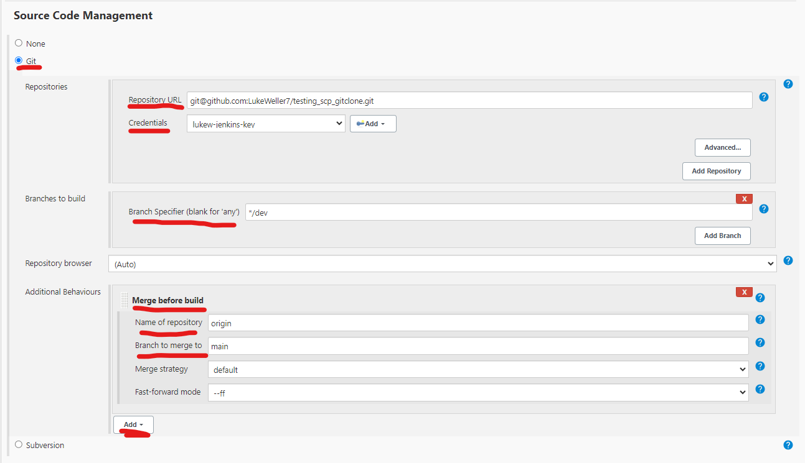
5. Build Environment
   1. SSH Agent
   2. file.pem
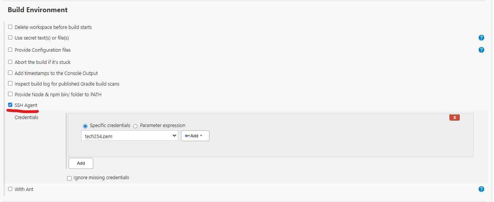
6. Post-build Actions
   1. Add post-build action
   2. Git publisher
   3. Merge Results
7. Apply
8. Save
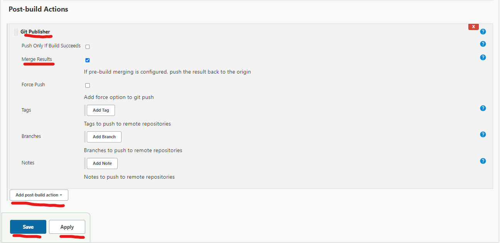


### Merging on GitHub
This step is to make sure that the merge request into GitHub is automated.
1. Go to your repo on GitHub
2. Go to repo settings
3. Select General
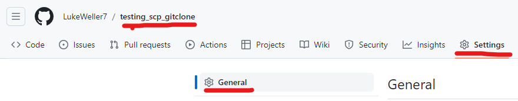
4. Scroll down to pull requests
5. Select Allow auto-merge
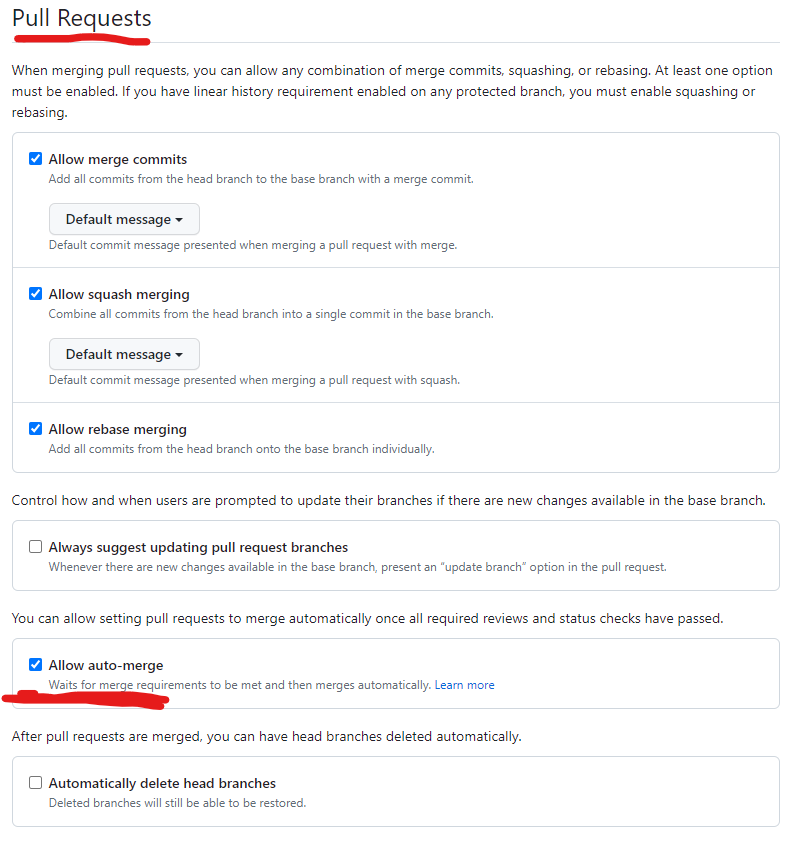


